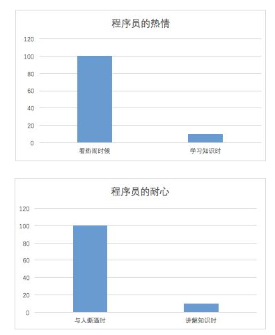

今天又下雨了，一连两天的雨……

老实说，心情很压抑

无聊起来，刷刷前端群，有这么一位群友说到「芳芳今天惹事了啊！」

天杀的，不给个链接我，好歹不用自己去搜索啊！

谷歌搜索一波，找到知乎链接，这是一个提问

[如何评价方应杭的前端水平？](https://www.zhihu.com/question/273860958)

## 问题缘由

> 芳芳老师写了一篇文章：
>
> [我不是很懂 Node.js 社区的 DRY 文化](https://zhuanlan.zhihu.com/p/35848291)
>
> 这篇文章我没去看，即便看了也无法理解，所以我选择了不看
>
> 为什么会发出这个提问？那个提问者的高中同学，打算报饥人谷的培训班，于是向她问一下意见
>
> 之前这个提问是，附带有两个截图的呀！反正其内容就是有两位大佬驳芳芳这篇文章，说得话刺耳，搞得芳芳的技术水平名不副实一样

## 回答

### 1.那些回答对我有点触动的话？

#### 评价一个人的技术？

> 1. 不能根据一个点，就能评价一个人，如帖这种大字报一样，片面、断章取义、无中生有、偷换概念……
>
>    「提问者搞得Yip和芳芳好像有仇一样（第一次看的时候我也是这样认为的，哈哈）」
>
> 2. 不要看大佬对大佬的评价，就是客观的，得需要就事论事。不能贴标签
>
> 3. 你不理解这个人做得事？打算diss他，也许他是屁股决定脑袋的呢？立场不同，想的也会有所不同。
>
> 4. 假如这个人在这行业里是资深的，你就不要说一些诸如「智商不行」、「认为傻子都不会辞职的岗位，然后辞职 了，就说他能力差甚至被辞退」之类的这些无厘头的话
>
> 5. 我之前认为「面试、看博客或者github项目能客观评价一个人的技术水平」，其实不然，「评价一个人的技术如何，面试和看blog或者github项目都很难短时间有个公平判断。因为一个人的技术能力不光有硬的还有软的，比如说表达能力，辅导别人的能力，组织能力，创新能力等等。」

#### 知乎？前端社区？

> 「大家在知乎（其实这里不算前端社区，什么优秀回答者没什么卵用）就是没事的时候看看新闻八卦顺便讨论讨论技术，和玩微博一个性质。真的技术讨论还是在公司内部，在会议室，在项目中。很多很厉害的前端根本不在乎这个，大家都是工作优先的，工作忙完了还要回家奶孩子做家务，没时间撕逼的。
>
> 你个人的影响力除了招聘有点用，其实对团队来说并不那么重要的，团队重要的还是公司业绩kpi，你的前端技术对于企业带来了什么这些问题。
>
> 保持热度本身就是一件很难的事，但是千万别选撕逼。」

#### 程序员的热情和耐心？

> 一幅图：
>
> 
>
> 可看出：
>
> 又要学新的东西，哎，何时才是个头啊！我的心情犹如窗外的乌云，阴沉阴沉的……
>
> 饿货，来根士力架吧！听说有人撕逼
>
> 目光顿时炯炯有神，又是看热闹的时候了……
>
> ------
>
> 为啥还不懂啊？我都讲了几百遍了啊
>
> 有这么夸张吗？
>
> 我没有耐心继续给你讲下去了，你先记住结论，之后慢慢思索……
>
> 好吧
>
> 听说有人在驳他人的文章啊！这文章写了啥？有那么「热闹」吗？
>
> 他们真有耐心啊！一定要骨头里挑刺……即便有刺，但是有那么多刺吗？

#### 鲁棒？啥意思？

> [王磊的回答：](https://www.zhihu.com/people/wlblink/activities)
>
> is-odd 是很蠢啊。
>
> 当你需要写一个奇偶判断的时候，你的输入总不是大风刮来的，来源无非是API返回，用户输入之类的，在一个正常的 JS（非TS）程序中，变量的类型虽然不是完全确定的，但是绝非是不可控的。所以并不需要一个完全“鲁棒”的 isOdd 函数。
>
> 再来谈谈我对鲁棒的理解：
>
> 一个鲁棒的 isOdd 函数应该对所有非 number 类型的输入抛出异常，即使支持对string parseInt，也应该以开关形式提供，绝不应该对于除此之外的类型的输入正常返回，这不叫鲁棒，这叫瞎 JB 搞。
>
> 能对于数组之类的乱七八糟的玩意都能返回的 isOdd 是一种愚蠢的实现, 和到处框 try 然后在 catch 里 console.log 没有本质区别。
>
> 当你的程序的执行逻辑把一个数组传进  isOdd 里时，一定是哪里出错了，是不符合预期的执行行为，所以这时候应该做的就是抛出异常，而不是像鸵鸟一样，要求 isOdd 返回一个false，然后这个执行流在其他的地方出更大的 bug。作为一个隐藏了细节的库，用户可能并不清楚里面吃掉了这个异常，你管这个叫鲁棒，我管这个叫不负责任。
>
> 一个真正健壮的程序是能够及时发现此类行为并停止运行，这是软件工程的基本思路，对于异常进行检测，如果是已知的就处理，未知的就层层抛出，暴露问题。

#### 关于职业培训？

> 1. 做职业培训的老师，在知乎上发表文章，他人评价，若有黑点，可能会筛选评论，以防止被怼了影响生意
> 2. 「职业培训本来不丢人，推广宣传更不丢人，丢人的一个是虚假宣传，一个是带着恶意去泼脏水的人，都不是好东西。」
> 3. 「个人也不喜欢培训学校出来的人，不管是招还是合作，也从不推荐任何新人去上(速成)培训班。真要低成本碎片化的成长还得靠自己，多学点英语看点论文，真要花钱还不如多听两个 Live / Gitchat，买个 VPN 多看几个 Youtube 视频。终其目的无非是为了面试，往youtube上一搜面试题就一大推」

#### 前端网红？

> 前端网红有可能是来知乎开课收智商税噶韭菜的，不炒一点不一样的东西怎么能绕开同质化的竞争

#### 口水博文？

> This is about the 100th identical "left-pad is indicative of a bigger" issue articles I've seen. None of them actually suggesting alternatives, solutions, or feedback. They're just tons of "Hey, I'm just saying..." in blogspam form. Complete wastes of time.
>
> 翻译：这是我见过的第 100 篇 “left-pad 预示着更大” 问题的文章，这些文章没有一篇提出建议、替代方案或反馈，就是一大堆 “嘿，在我看来……” 的口水博文形式。完全是浪费时间。
>
> ------
>
> 如果真的想静下心学习，让自个更客观的看待/解决问题，可以选择看这个
>
> [如何看待 left-pad 事件](http://johnhax.net/2016/all-about-left-pad/)

#### 几个结论？

> 1. 不要盲目崇拜什么人也不要diss别人，一点对自己的提高也没有。
>
> 2. diss别人的性格早晚会给自己带来一些麻烦
>
> 3. 每个人的心中都住着一位大牛，也许这个人在你心中是大牛，可在他人心中却不是。
>
> 4. 你的技术可以非常水，不过你总得要有一点优点才可以啊！比如：野路子多，执行力强一点，人挺随和
>
> 5. 对某个人个人的评价这种事真的很low，除非是社会事件
>
> 6. 大牛从来都不是自己认的，都是从别人嘴里说的。我技术也就那样，运气好点罢了，比上不足比下有余，老板交代的任务能干好，本职工作能完成就行
>
> 7. 每个人都有厉害和不厉害的地方，自己和自己比吧。我比去年的自己牛逼多了，可让我插会腰
>
> 8. 存在很多搏眼球或者虚名上位实则没有任何贡献产出动辄嘲讽显摆的大v，希望你是个有技术情怀的人，不要被他人给带变质了
>
> 9. 写代码不就是每一行都要做选择题的过程吗
>
> 10. 我确实没有去扒isOdd的引用，我遇到判断肯定也是直接用%2了，但是这并不影响我去了解这种库，我肯定不会diss他，而是为什么会有这种库，从里面能学到什么，举一反三的学习，其实每个人的代码习惯和编程理念都不一样，我属于入乡随俗的，吸取所有人的经验，这样才有利于成长。
>
> 11. 芳芳老师的文章：「比较极端，有可能会得出攻击性很强的结论」。他人建议：「认真确认一下自己的推导过程有是不是合理，尤其是在你得出攻击性很强的结论的时候」
>
> 12. 芳芳老师的一些观点：「对于前端他认为应该多了解一些基础知识，先是工程师再是前端工程师」
>
> 13. 有时间还是多关心关心技术吧...关注文章本身的bug，而不是针对作者，这样很没有意义
>
>     如这个技术——[怎么做到 200 行代码实现实时人脸识别的](https://tkv.io/posts/picojs-intro/demo/)
>
>     ==这牛逼啊，以后不用打开QQ摄像头，看看自己了呀！突然想起了玄幻小说里的剧情，这件东西前身是很牛逼的，没想到，现在竟被你用于垫凳子==
>
> 14. 越学越觉得自己懂得少，这个我想学编程都会有的感觉
>
> 15. 芳芳老师文章的质量：「有些文章还是不错的吧？至少对于计算机基础没那么牢固，没有熟读各种规范、标准、框架更新文档的人来说……还是有些用的。」
>
> 

## 参考链接

> [什么是大字报？](http://blog.sciencenet.cn/blog-2211-608642.html)
>
> [屁股决定脑袋是什么意思？](https://www.zhihu.com/question/22245984)
>
> [diss是什么梗？](http://www.fanjian.net/jbk/diss.html)
>
> [人设崩塌？](http://www.vice.cn/read/the-collapse-of-characters-design)
>
> [可把我厉害了叉会腰是什么梗](http://www.7230.com/a64196)
>
> [撕逼](https://www.zhihu.com/question/21909918)
>
> [pr是啥意思？能pr他人的项目是件很happy的事？](https://www.zhihu.com/question/21682976)
>
> [「背书」是何意？](https://www.zhihu.com/question/22381679)

